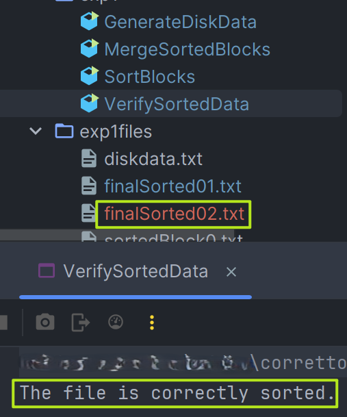
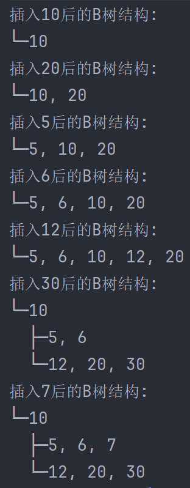
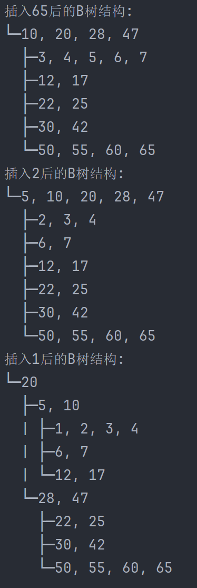
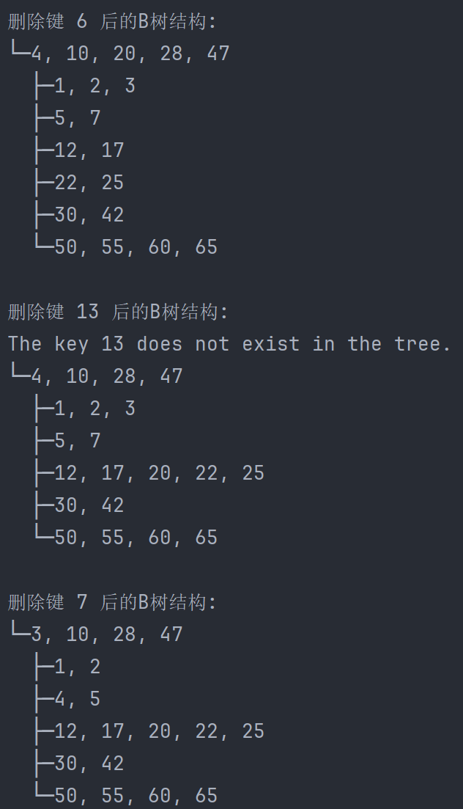

# 高级数据库基础实验报告

[TOC]


> #### 实验环境
>
> - **语言**：Java 11
> - **IDE**：IntelliJ IDEA 2024.1
>


## 实验一：基于两阶段归并排序的集合运算

### 1. 实验目标

通过实现该任务，综合掌握数据从磁盘存储、缓冲区划分、磁盘到缓冲区的I/O操作及对应的集合运算处理流程。

### 2. 实验过程

#### 2.1 数据生成（GenerateDiskData.java）

该部分使用`Random`类生成100万个0到99999之间的随机整数，并通过`FileWriter`将这些整数写入到`diskdata.txt`文件中。这一步骤为后续的排序和归并操作准备了测试数据。

#### 2.2 块排序（SortBlocks.java）

从`diskdata.txt`中读取数据，每10000行数据视为一个块，对每个数据块进行排序。排序使用Java的`Collections.sort()`方法。排序完成后，将排序后的数据存储在以`sortedBlock`为前缀的多个文件中，为下一步的归并排序作准备。

#### 2.3 归并排序（MergeSortedBlocks.java）

对步骤2.2生成的已排序的数据块进行归并排序。此实验中采用了两路归并排序算法，合并两个排序文件`sortedBlock0.txt`和`sortedBlock1.txt`，输出结果存储在`finalSorted02.txt`中。

归并的实现代码：
```java
String line1 = reader1.readLine();
String line2 = reader2.readLine();
while (line1 != null && line2 != null) {
     int num1 = Integer.parseInt(line1);
     int num2 = Integer.parseInt(line2);
     if (num1 < num2) {
        writer.write(line1 + "\n");
        line1 = reader1.readLine();
     } else {
        writer.write(line2 + "\n");
        line2 = reader2.readLine();
     }
}
while (line1 != null) {
    writer.write(line1 + "\n");
    line1 = reader1.readLine();
}
while (line2 != null) {
    writer.write(line2 + "\n");
    line2 = reader2.readLine();
}
```


#### 2.4 验证排序结果（VerifySortedData.java）

读取`finalSorted02.txt`文件，验证数据是否正确排序。程序通过逐行比较，确保每一行的数据都不小于前一行，从而确认数据的整体排序正确性。下面是运行结果：




## 实验二：B-树实验

### 1. 实验目标

通过实现该任务，掌握B-树的结构，并实现B-树的建立、插入、删除等操作。

### 2. 实验过程

#### 2.1 B树 定义

**B树**（英语：B-tree），是一种在计算机科学自平衡的树，能够保持数据有序。这种数据结构能够让查找数据、顺序访问、插入数据及删除的动作，都在对数时间内完成。B树，概括来说是一个一般化的二叉搜索树一个节点可以拥有2个以上的子节点。与自平衡二叉查找树不同，B树适用于读写相对大的数据块的存储系统，例如磁盘。B树减少定位记录时所经历的中间过程，从而加快访问速度。B树这种数据结构可以用来描述外部存储。这种数据结构常被应用在数据库和文件系统的实现上。（来自Wikipedia）

#### 2.2 B树的实现（BTreeNode.java，BTree.java）

`BTreeNode`类包含以下核心属性和方法：

- **keys**: 一个整型数组，存储节点中的键。在一个B树节点中，键的数量可以达到最多`2t-1`个。
- **children**: `BTreeNode`数组，存储指向节点子节点的引用。一个节点可以有最多`2t`个子节点。
- **n**: 整型，表示当前节点中存储的键的数量。
- **leaf**: 布尔值，标记当前节点是否为叶节点。
- **t**: 节点的最小度数，决定了节点分裂和合并的条件。

B树节点的构造器为：

```java
public BTreeNode(int t, boolean leaf) {
        this.t = t;
        this.leaf = leaf;
        this.keys = new int[2*t - 1]; 
        this.children = new BTreeNode[2*t]; 
        this.n = 0; // 初始时，节点中没有键
}
```

节点的主要方法包括：

- **insertNonFull**: 当节点未满（即包含的键数少于`2t-1`）时，用于插入新键。如果节点是叶节点，直接在适当位置插入新键。如果节点是内部节点，则可能需要递归地在适当的子节点中插入新键。
- **splitChild**: 用于分裂满子节点。当子节点的键数达到最大限制`2t-1`时，此方法被调用。它会创建一个新节点，将满节点的键和子节点分配给新节点和原节点。
- **deleteKey**: 实现从节点中删除键的功能。这包括处理从叶节点直接删除和从内部节点删除需要递归调整的情况。

B树的构造器为：

```java
public BTree (int t) {
		this.root = null;
		this.t = t;
}
```

另外定义了两个函数：`insert`和 `delete`来实现B树的插入和删除，B树的建立可以通过插入来实现。

### 3. 实验结果

编写一个测试类`BTreeTest.java`来进行测试。

#### 3.1 部分结果截图：



#### 3.2 运行结果说明

**插入操作**：初始时，B树为空。随着连续的插入操作（如插入键10, 20, 5, 6），B树逐渐增长，并在节点键数达到上限时自动分裂。例如，当插入30后，原先的根节点（包含5, 6, 10, 12, 20）因为超出最小度数限制而分裂成三部分：中间键10上升为新的根节点，左右子节点分别包含小于和大于10的键。这样的分裂保持了树的平衡，确保了深度的最小化，从而优化查询效率。

**删除操作**：删除操作考虑了各种复杂的情况，如直接从叶节点删除键，或者从内部节点删除键时进行必要的键借用和节点合并，以保持树的平衡。例如，删除键6后，B树结构适当调整以填补空缺，并保持了结构的整齐。当尝试删除不存在的键（如键13）时，系统正确地报告了“键不存在”的信息，这验证了错误处理的正确性。

**结构变化**：每次插入或删除操作后，B树的结构都有所变化，但始终维持了B树的基本性质：节点的键始终保持排序，每个节点的键数保持在规定的范围内，除了根节点外。这些操作的结果清晰地展示了B树如何通过局部调整来维持全局的平衡。


## 实验三：构建语法分析树实验

### 1. 实验目标

通过实现该任务，综合掌握基于关系代数表达式的语法分析树构建过程及功能。

### 2. 实验过程

#### 2.1 手动实现

首先，定义了多个节点类代表SQL查询中的特定元素：

- `TreeNode`：基础的树节点类，包含值和子节点列表。
- `SelectNode`、`FromNode`、`WhereNode`、`GroupByNode`、`OrderByNode`：分别对应SQL中的SELECT、FROM、WHERE、GROUP BY和ORDER BY子句的节点。
- `ExpressionNode` 和 `LogicalOpNode`：用于表示表达式和逻辑运算符。

然后`deSQLParser`类负责解析SQL查询并构建语法树：

- **预处理**：将SQL语句转换为大写并整理关键词周围的空格，以便于分割。
- **分割处理**：使用正则表达式根据SQL关键词分割整个查询语句。
- **子句处理**：为每种子句类型创建对应的节点，并解析具体的内容填充到子节点中。例如，对于`SELECT`子句，解析后的列名被添加为`SelectNode`的子节点。

该解析器可以接受形如“SELECT * FROM table WHERE condition GROUP BY column ORDER BY column”的查询语句，后来为了实现解析更复杂的语句，使用了第三方库。

#### 2.2 使用ANTLR4

ANTLR4利用预先定义的语法规则自动化解析过程，生成精确的语法分析树。

大致流程如下：

1. **生成词法和语法分析器**：基于SQL的语法规则文件，使用ANTLR4生成`SqlLexer`和`SqlParser`。
2. **初始化输入**：从字符串中读取SQL查询语句，这里包括两个查询示例，分别处理不同的WHERE子句条件。
3. **词法分析**：使用`SqlLexer`将输入字符串转换为词法符号流。
4. **语法分析**：通过`SqlParser`解析词法符号流，生成解析树。
5. **输出语法树**：使用ANTLR4的工具方法打印出解析树的文本表示，显示查询语句的结构。

SQL的语法规则文件：

```yaml
grammar Sql;

query: select_clause from_clause where_clause? ;

select_clause: 'SELECT' column_list ;
from_clause: 'FROM' table_name ;
where_clause: 'WHERE' condition ;

column_list: IDENTIFIER (',' IDENTIFIER)* ;
table_name: IDENTIFIER ;
condition: expression ;

expression: IDENTIFIER '=' STRING_LITERAL
          | expression 'AND' expression
          | expression 'OR' expression
          ;

IDENTIFIER: [a-zA-Z_][a-zA-Z_0-9]* ;
STRING_LITERAL: '\'' ( ~'\'' | '\'\'' )* '\'' ;
WS: [ \t\r\n]+ -> skip ;

```

输出：

```sql
(query 
	(select_clause SELECT (column_list column1 , column2)) 
	(from_clause FROM (table_name table)) 
	(where_clause WHERE 
		(condition 
			(expression 
				(expression column1 = 'value1') AND 
				(expression column2 = 'value2')
			)
		)
	)
)
```


## 实验四：事务调度管理实验

### 1. 实验目标

通过该任务，掌握事务调度原理，特别是基于时间戳的调度以及调度过程中时间戳的变化等。

### 2. 实验过程

#### 2.1 关键类和实现

- **Transaction 类**：表示单个事务，包含事务ID、时间戳和操作列表。事务可以添加多个操作，操作类型包括读和写。
- **Operation 类**：代表单个操作，具有操作类型（读或写）和操作的数据项。
- **TimestampScheduler 类**：负责事务的添加、排序和执行。调度器按照事务的时间戳顺序执行，确保时间戳较小的事务先执行。

#### 2.2 执行流程

1. **添加事务**：创建事务对象，分配时间戳，添加到调度器的事务列表中。
2. **排序事务**：调度器根据事务的时间戳对事务列表进行排序。
3. **执行事务**：调度器按排序后的顺序执行每个事务的所有操作。读操作输出读取的数据项，写操作更新数据项的时间戳并输出写操作详情。

### 3. 实验结果

运行结果：

```sql
sqlCopy codeExecuting transaction 1 with timestamp 1715594465444
Transaction 1 writes Item1 with new timestamp 1715594465444
Transaction 1 reads Item2
Executing transaction 2 with timestamp 1715594465544
Transaction 2 writes Item2 with new timestamp 1715594465544
Transaction 2 reads Item1
```

- **事务1的执行**：
  - 事务1首先对“Item1”进行了写操作，并更新了“Item1”的时间戳为1715594465444。
  - 紧接着，事务1对“Item2”进行了读操作，这一操作不涉及时间戳更新，但验证了读操作的正确记录。
- **事务2的执行**：
  - 在事务1之后，事务2执行，并对“Item2”进行写操作，更新了“Item2”的时间戳为1715594465544。
  - 事务2还读取了“Item1”，显示了对先前写入的数据项的正确访问。

输出结果显示了调度器如何有效地根据时间戳顺序处理各事务，确保了事务的顺序性和数据的一致性。每个事务的操作按照其时间戳的顺序执行，符合时间戳调度的设计原理。


## 实验五：关联规则挖掘算法实验

### 1. 实验目的

通过该任务，掌握关联规则挖掘算法，了解数据挖掘基本过程。

### 2. 实验过程

#### 2.1 Apriori算法介绍

在计算机科学以及数据挖掘领域中， **先验算法**（Apriori Algorithm）是关联规则学习的经典算法之一。先验算法的设计目的是为了处理包含交易信息内容的数据库（例如,顾客购买的商品清单，或者网页常访清单。）而其他的算法则是设计用来寻找无交易信息（如Winepi算法和Minepi算法）或无时间标记（如DNA测序）的数据之间的联系规则。（来自Wikipedia）

#### 2.2 算法实现

数据集说明：retail.txt文件包含88,162行，每行代表一个购物篮，每个购物篮包含多个产品编号。

1. 计算单项频率

通过迭代文件中的每一行，分割每行来获取单个产品，并在`HashMap`中更新每个产品的出现次数。

```java
//这段代码处理每一行（即一个购物篮），将每个项的频率记录在HashMap中。
while ((line = br.readLine()) != null && num_baskets_read < num_baskets) {
  String[] linesplit = line.split(" ");
  for (int i = 0; i < linesplit.length; i++) {
    int item = Integer.parseInt(linesplit[i]);
    hash.put(item, hash.getOrDefault(item, 0) + 1);
  }
  num_baskets_read++;
}
```

2. 生成候选队

从已经筛选出的频繁单项中生成所有可能的产品对，并初始化这些对的计数。

```java
// 初始化一个二维数组来存储所有可能的候选对和它们的频率。
int[][] pairs = new int[hashmap.size() * (hashmap.size() - 1) / 2][3];
```

3. 筛选频繁对

计算每个候选对在所有购物篮中的出现次数，如果一个对的出现次数大于或等于支持度阈值，则认为是频繁的。

```java
// 检查每个购物篮是否包含特定的产品对，如果包含，则增加该对的计数。
for (int j = 0; j < (hashmap.size() * (hashmap.size() - 1) / 2); j++) {
  boolean containsElement1 = false;
  boolean containsElement2 = false;
  for (int k : array) {
    if (pairs[j][0] == k) {
      containsElement1 = true;
    }
    if (pairs[j][1] == k) {
      containsElement2 = true;
    }
    if (containsElement1 && containsElement2) {
      pairs[j][2]++;
      break;
    }
  }
}
```

#### 2.3 实验结果

```bash
Support threshold: 4408
[48, 41]: 9018
[39, 41]: 11414
[48, 32]: 8034
[39, 32]: 8455
[48, 38]: 7944
[48, 39]: 29142
[38, 39]: 10345
```

